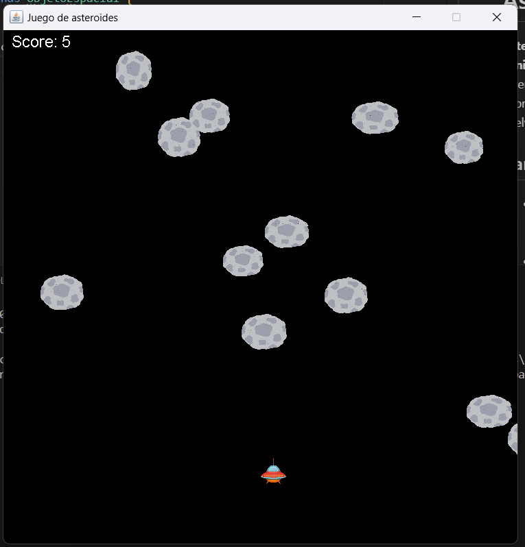

Here’s the translation into English:

---

# Asteroid Dodger

**Asteroid Dodger** is a simple arcade game made in **vanilla Java** where you control a spaceship that must dodge asteroids while traveling through space.

The goal is to survive as long as possible while the asteroids become faster and more numerous.



---

## Features 📋

- **Controllable Spaceship**: Control the spaceship using the arrow keys to move up, down, left, and right.
- **Random Asteroids**: Asteroids appear randomly from different directions and at varying speeds, making each game unique.
- **Collisions**: If the spaceship collides with an asteroid, the game ends.
- **Scoring System**: The longer you survive, the higher your score.
- **Increasing Difficulty**: As the game progresses, the asteroids move faster, increasing the challenge.
  
## Technologies Used

- **Java**: The entire game is implemented in vanilla Java without external libraries.
- **Swing**: Used for the graphical interface of the game (game window and components).
- **AWT**: Used for handling graphics to draw the spaceship and asteroids on the screen.
  
## Controls

- **Up Arrow**: Move the spaceship up.
- **Down Arrow**: Move the spaceship down.
- **Left Arrow**: Move the spaceship left.
- **Right Arrow**: Move the spaceship right.

## Installation and Execution 🔧

1. Clone the repository or download the ZIP file:
    ```bash
    git clone https://github.com/yourusername/asteroid-dodger.git
    ```
2. Navigate to the project directory:
    ```bash
    cd asteroid-dodger
    ```
3. Compile the project:
    ```bash
    javac src/com/asteroidgame/*.java
    ```
4. Run the game:
    ```bash
    java src/com/asteroidgame/Main
    ```

## How to Play 🕹️

- The goal is to dodge the asteroids falling from the top of the screen.
- Use the arrow keys to move the spaceship.
- The game ends when the spaceship collides with an asteroid.
- Your score is based on how long you survive.
  
## Project Structure 🔩

```
asteroid-dodger/
├── src/
│     └── asteroidgame/
│           ├── App.java                # Main class that starts the game
│           ├── JuegoAsteroides.java    # Core game logic
│           ├── Nave.java               # Logic and representation of the spaceship
│           ├── Asteroide.java          # Logic and representation of the asteroids
│           └── ObjetoEspacial.java     # Parent class of spaceship and asteroid
└── README.md                           # README file with project details
```

## Customization 🏵️

- **Asteroid Speed**: You can adjust the speed or spawn rate of asteroids in the `Asteroid.java` class if you want to modify the difficulty of the game.
- **Spaceship Design**: You can change the appearance of the spaceship in the `Nave.java` class.
- **Game Size**: Modify the dimensions of the game window in the `App.java` class.

## Special Thanks 🎁

Thanks to the Java developer community for providing helpful resources and examples to improve my programming skills.

---

Made by [Mansour Lo Lo] - mansourlol440@gmail.com

---